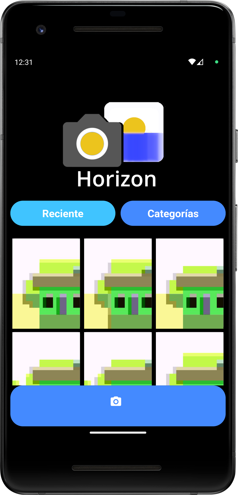
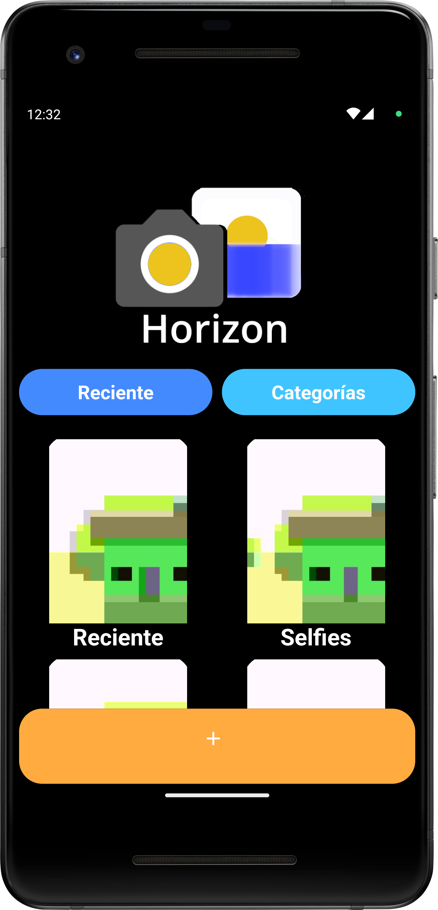
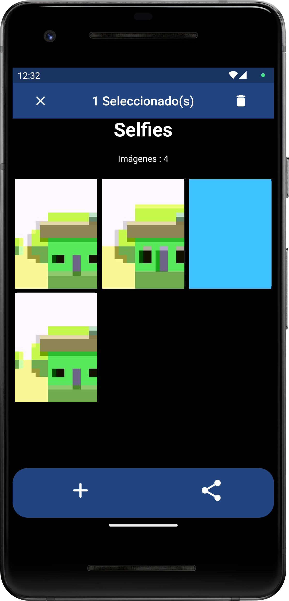
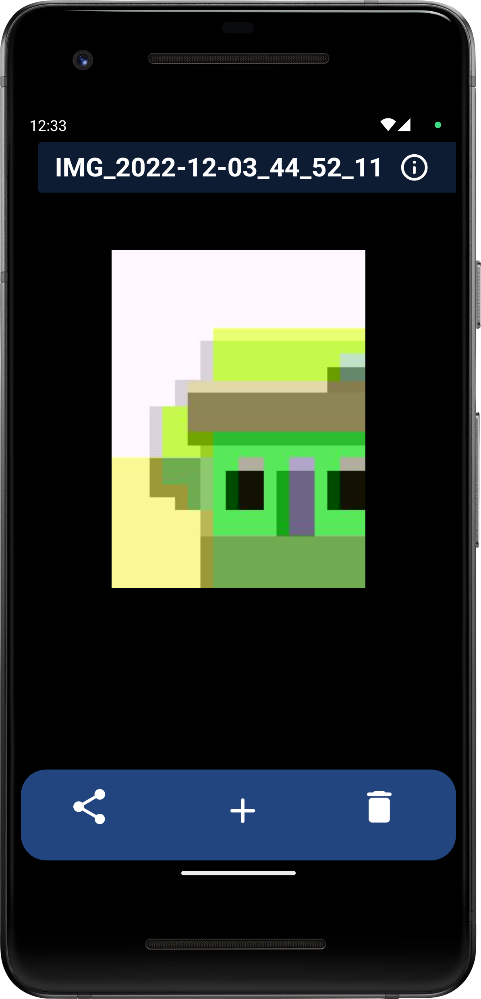

 


 # Horizon
Aplicación que une galería y cámara en un único entorno para android.


# Platform Compatibility

- [x] android


# Dependencies
All plugins used on this project
```
dependencies :
  flutter_launcher_icons: ^0.11.0
  camera: ^0.9.3+1
  intl: ^0.17.0
  share: ^2.0.4
  restart_app: ^1.1.1
  video_player: ^2.4.8

```

# Permissions
All permissions required for this application
```
    <uses-permission android:name="android.permission.WRITE_EXTERNAL_STORAGE" />
    <uses-permission android:name="android.permission.READ_EXTERNAL_STORAGE" />

```

 # Screens





